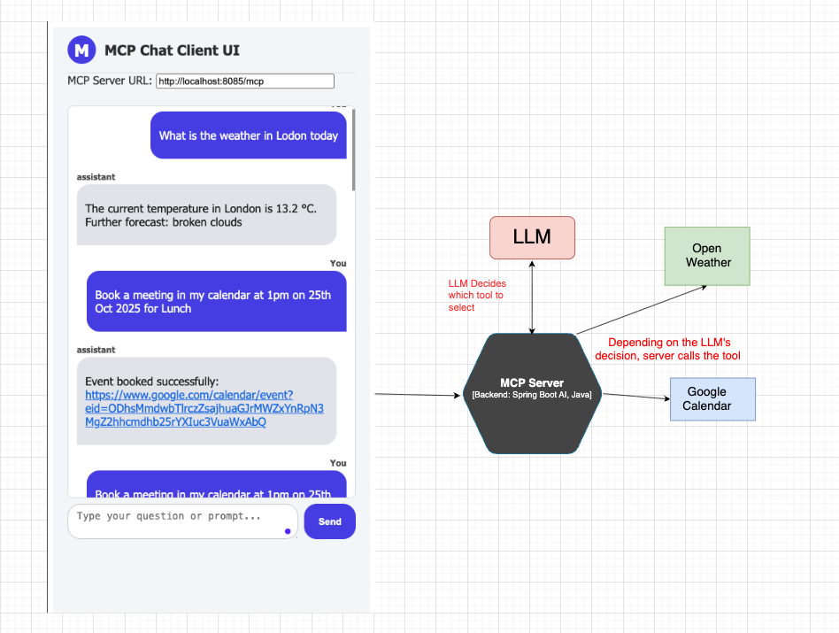
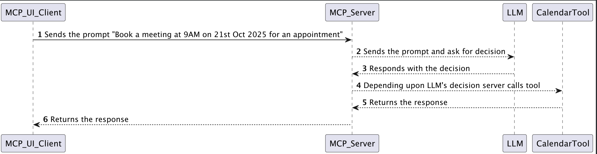

# MCP Server (Spring AI + Java) + Chat Client UI (React + Vite)
Java based backend (http://localhost:8085) interact with Chat Assistant UI via http://localhost:5173.
It supports three tools:
- Chat with LLM (askChat)
- Weather lookup (getWeather)
- Google Calendar booking (bookEvent)

## Features
- MCP Server: Handles tool invocation and streams responses.
- Tools implemented:
    - CalendarTool → Google Calendar API integration
    - WeatherTool → OpenWeather API
    - ChatTool → OpenRouter LLM
- Chat UI with Markdown support using react-markdown and remark-gfm.

### Prerequisites
- Java 21+
- Maven 3.9+
- Google Cloud Project with Calendar API enabled
- OpenRouter API key → https://openrouter.ai
- OpenWeather API key → https://openweathermap.org/api
- Node.js >= 18

## Quick start
- Steps to run are in individual (backend & frontend) directory

## Demo

## Architecture

